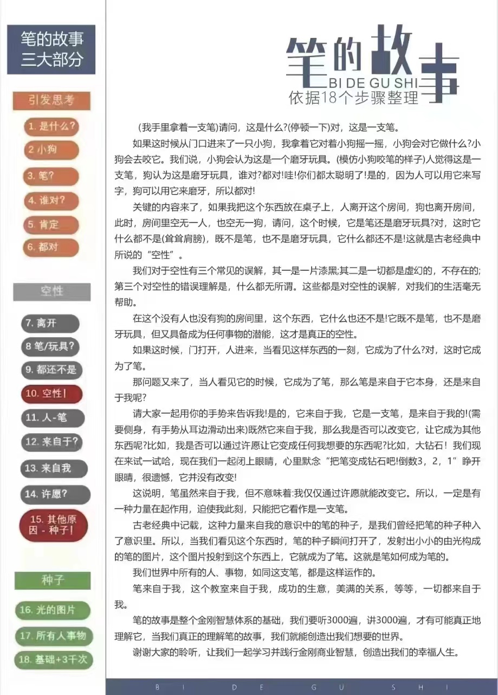

（我手里拿着一支笔） 请问，这是什么？

（停顿一下）对，这是一支笔。

如果这时候从门口进来了一只小狗，我拿着它对着小狗摇一摇，小狗会对它做什么？&#x20;

小狗会去咬它。

我们说，小狗会认为这是一个磨牙玩具。（模仿小狗咬笔的样子）

人觉得这是一支笔，狗认为这是磨牙玩具，谁对？

都对！哇！你们都太聪明了！

是的，因为人可以用它来写字，狗可以用它来磨牙，所以都对！

关键的内容来了，如果我把这个东西放在桌子上，人离开这个房间，狗也离开房间，此时，房间里空无一人，也空无一狗，请问，这个时侯，它是什么呢？

对，这时它什么都不是（耸耸肩膀），既不是笔，也不是磨牙玩具，它什么都还不是！

这就是古老经典中所说的“空性”。

我们对于空性有三个经典的误解，其一是一片漆黑；其二是一切都是虚幻的，不存在的；第三个对空性的错误理解是，什么都无所谓。

这些都是对空性的误解，对我们的生活毫无帮助。

在这个没有人也没有狗的房间里，这根东西，它什么也还不是！它，既不是笔，也不是磨牙玩具，但又具备成为任何事物的潜能，这才是真正的空性。

如果这时候，门打开，人进来，当看见这样东西的一刻，它成为了什么？对，这时它成为了笔。

那问题又来了，当人看见它的时候，它成为了笔，那么笔是来自于它本身，还是来自于我呢？

请大家一起用你的手势来告诉我！是的，

它来自于我，它是一支笔，是来自于我的！（需要侧身，有手势从耳边滑动出去）既然它来自于我，那么我是否可以改变它，让它成为其他东西呢？

比如，我是否可以通过许愿让它变成任何我想要的东西呢？比如，大钻石！我们现在来试一试哈，现在我们一起闭上眼睛，心里默念“把笔变成钻石吧！倒数 3，2，1”睁开眼睛，很遗憾，它并没有改变！

这说明，笔虽然来自于我，但不意味着：我仅仅通过许愿就能改变它。

所以，一定是有一种力量在起作用，迫使我此刻，只能把它看作是一支笔。

古老经典中记载，这种力量来自我的意识中的笔的种子，是我们曾经把笔的种子种入了意识里。

所以，当我们看见这个东西时，笔的种子瞬间打开了，发射出小小的由光构成的笔的图片，这个图片投射到这个东西上，它就成为了笔。

这就是笔如何成为笔的。我们世界中所有的人、事、物，如同这支笔，都是这样运作的。

笔来自于我，这个教室来自于我，成功的生意，美满的关系，等等，一切都来自于我。

笔的故事是整个金刚智慧体系的基础，我们要听 3000 遍，讲 3000 遍，才有可能真正地理解它当我们真正地理解笔的故事，我们就能创造出我们想要的世界。

谢谢大家的聆听，让我们一起学习并践行金刚商业智慧，创造出我们的幸福人生
