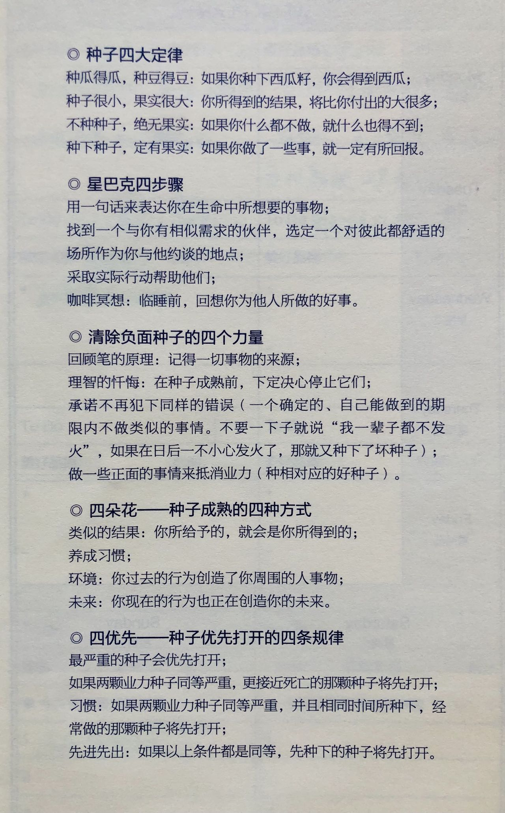

四定律

第1定律:种瓜得瓜

第2定律:种子虽小，果实很大

第3定律:不种种子，没有果实

第4定律:种下种子必定收获

四步骤

第1步:一句话说出你的目标

第2步:找到一个跟你有相同需求的人，做计划要怎样帮助他，选定合适的地点约见彼此

第3步:采取实际行动（直接给予帮助或对接资源，或教对方一起种种子）

第4步:咖啡冥想（为自己做的好事感到开心，回想助人的每一个细节，情绪，动机，感恩之情）

四力量

第1力量:回顾笔的故事，一切来源于我，是我创造出的结果，如果我重复种同样的种子，还会同样回到我身上。

第2力量:明智，不带自责地忏悔由于过去的无明而种下了坏种子。

第3力量:承诺一段可以做到的时间内不再种类似的坏种子。

第4力量:种正面相反的好种子去形成一个新的好习惯。

四朵花

第1朵花:类似的结果——你所给予的，就是你所得到的。

第2朵花:习惯——我们会养成做相同的（行为模式，语言模式，思维模式）

第3朵花:我们的环境——我周遭的环境中的人，事，物，他人对我说的话，做的行为，他们是如何思维，都是我们过去习惯性的身语意创造出来的。

第4朵花:我们的未来——我们现在的行为，语言，思维也正在创造我们的未来。

四优先

第1优先:最严重的种子将优先打开。

第2优先:如果两颗种子同等严重，更接近死亡的那颗种子将会先打开。

第3优先:习惯，如果两颗种子同等严重，并且相同时间所种下，经常种的那颗种子将会优先打开。

第4优先:先进先出，如果以上条件都是同等的，先种下的那颗种子将优先打开。
